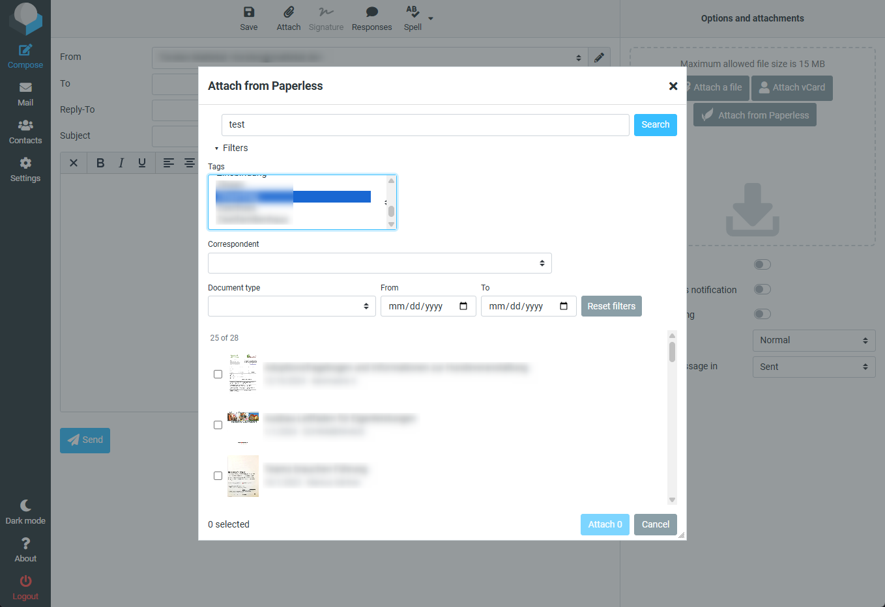
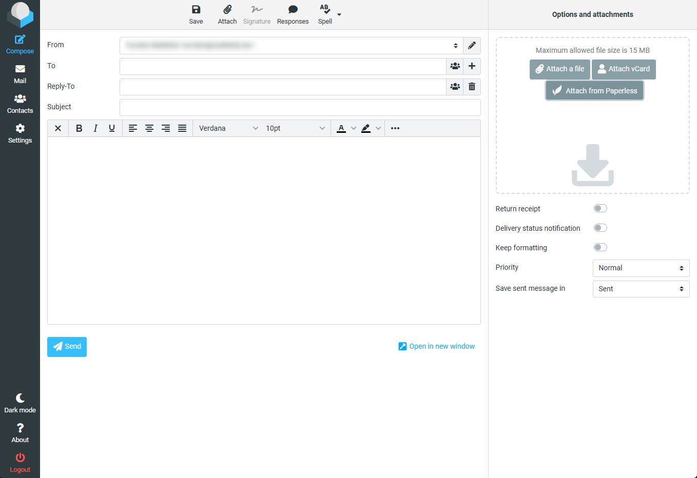
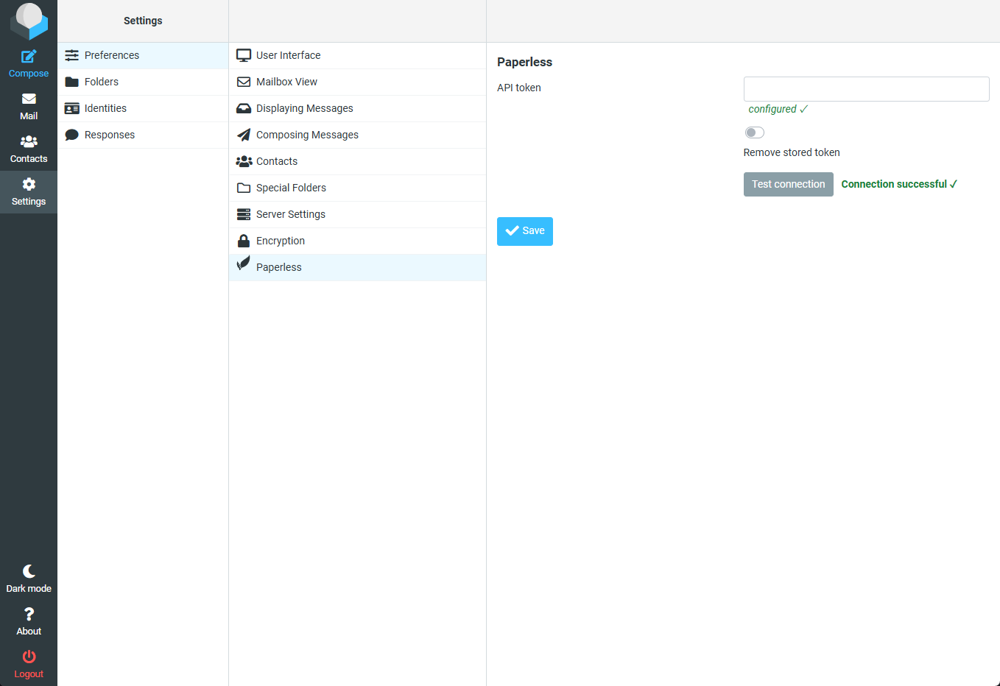

# Paperless Attach

[](https://github.com/dodjango/roundcube-paperless-attach/releases)
[](https://github.com/dodjango/roundcube-paperless-attach/actions/workflows/tests.yml)
[](LICENSE)


A Roundcube (Elastic skin) plugin to attach documents from a
[Paperless-ngx](https://docs.paperless-ngx.com/) instance straight from the compose window — search,
filter, pick, attached. No download/re-upload detour. It works **both ways**: you can also **save an
attachment from a received mail straight into Paperless** without leaving Roundcube. The per-user API
token is stored **encrypted** and all Paperless traffic stays **server-side**.



## Features

- 🔍 Search + filter your documents — full-text, tags, correspondent, document type, date range — and multi-select across pages.
- 🖇️ Attaches the searchable **archive PDF**, fetched server-side.
- 📥 **Save received attachments to Paperless** — a per-attachment button (and one in the attachment preview toolbar after *Open*) uploads the file server-side; the async import is polled and reported (saved ✓ / already exists / failed).
- 🔐 Token stored encrypted; token + Paperless URL never reach the browser (single server-side proxy).
- 🧰 Oversize rejected before download, born-digital docs skipped, per-item batch results, no duplicate attaches.
- 🐳 Survives `:latest` (bind-mount + `ROUNDCUBEMAIL_PLUGINS`, no image build).

| Compose button | Settings — token + connection test |
|---|---|
|  |  |

<sub>Document titles, correspondents and the sender address are blurred in the screenshots.</sub>

## Requirements

Roundcube **1.6.x** · **Elastic** skin only · PHP **7.4+** · a reachable Paperless-ngx instance.

## Install

**Composer** (from your Roundcube root):

```bash
composer require dodjango/paperless_attach
```

**Docker bind-mount** (recommended for `roundcube/roundcubemail:latest` — survives image updates):

```yaml
services:
  roundcubemail:
    volumes:
      - ./plugins/paperless_attach:/var/www/html/plugins/paperless_attach:ro
    environment:
      - ROUNDCUBEMAIL_PLUGINS=archive,zipdownload,...,paperless_attach   # append, keep the rest
      - ROUNDCUBEMAIL_DES_KEY=<EXACTLY 24 characters>                    # encrypts the token
```

Set PHP `upload_max_filesize` / `post_max_size` / `memory_limit` **≥** your Roundcube upload limit, otherwise the effective attachment cap drops to the lower value.

> ⚠️ **Never change `des_key` after tokens are stored** — it makes all stored tokens (and sessions) undecryptable; every user would have to re-enter their token. Pin it once.

## Configure

- **Token** (per user): *Settings → Paperless* → paste your Paperless API token → *Save* → *Test connection*.
- **Paperless URL** (server-side): copy `config.inc.php.dist` → `config.inc.php` and set `$config['paperless_url']`. It is server-fixed (SSRF guard — no per-user URL field); the default `http://paperless-webserver:8000` is an internal Docker hostname, so most installs must change it.
- **Max upload size** (optional, server-side): `$config['paperless_max_upload_size']` caps a received attachment uploaded to Paperless (default `100M`; `0` disables the guard).

## Security

Token encrypted via `rcube::encrypt()` — never stored in DB plaintext, echoed to the field, or placed in `rcmail.env`/AJAX. All Paperless calls originate from one server-side proxy (`lib/PaperlessClient.php`) with redirects disabled, enforced timeouts, and integer-validated document ids. Designed for **internal-network** use.

## Status

In daily use on the author's self-hosted stack. Best-effort community plugin (no warranty), so far verified on a single deployment; testing on other Roundcube 1.6.x setups, issues and PRs are very welcome.

## Contributing & releases

[Conventional Commits](https://www.conventionalcommits.org/) + [Semantic Versioning](https://semver.org/), released automatically via [release-please](https://github.com/googleapis/release-please). See [`CONTRIBUTING.md`](CONTRIBUTING.md).

**Tests:** a PHPUnit suite covers the server-side Paperless client (`lib/PaperlessClient.php`) — run `composer install && composer test`. CI runs it on PHP 7.4 / 8.0 / 8.1.

## Out of scope (v2)

Archive-vs-original choice per document · inline PDF preview · saved searches · skins other than Elastic.

## Author & license

Created and maintained by **[@dodjango](https://github.com/dodjango)**. Built with the help of AI tooling (Claude); all code is human-reviewed and live-tested.

Licensed under **GPL-3.0-or-later** — see [`LICENSE`](LICENSE).
